PtsAdm -- is mobile client CRM-system for administrate patients of dentist clinic

The first thing, what is necessary to do is login in the system. For now registrations not finished in mobile client, so just use test credentials: 
```
login: test@gmail.com
password: 1111
```
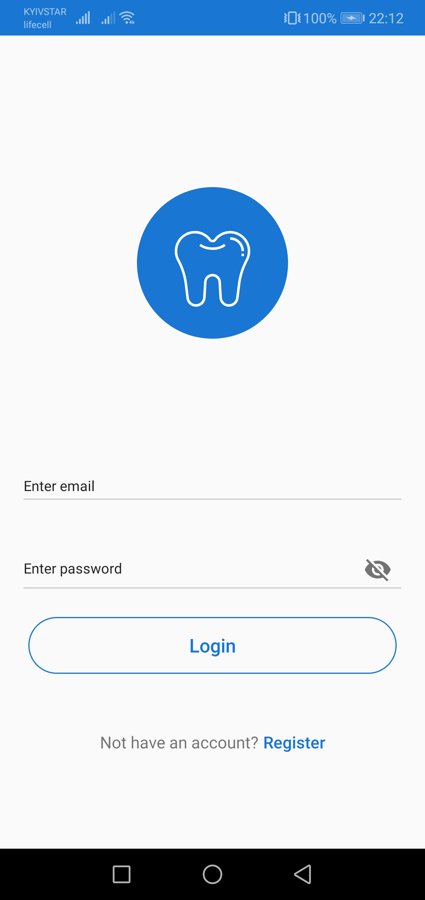 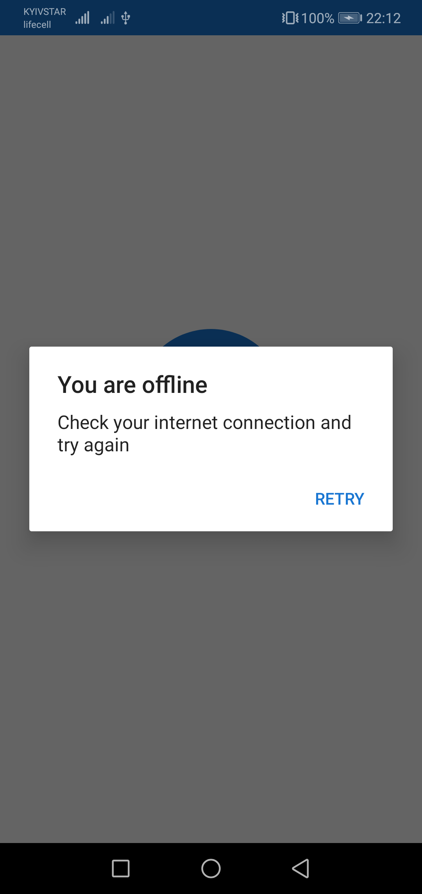

On first screenshot below is an example of sign in form. And the second one is stub, if internet connection disabled.

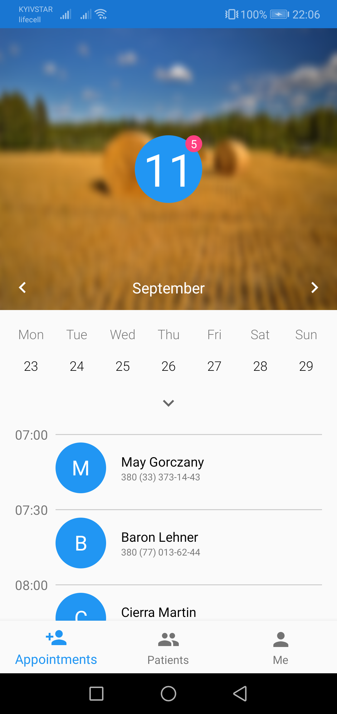 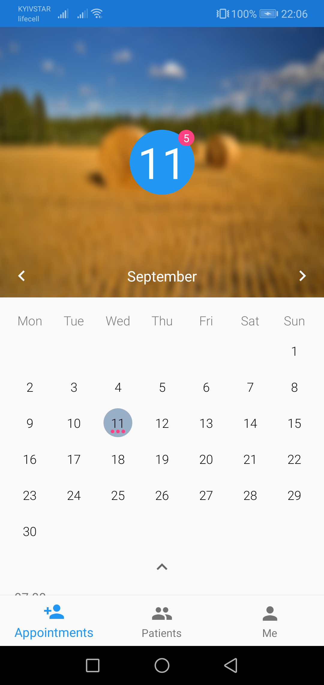 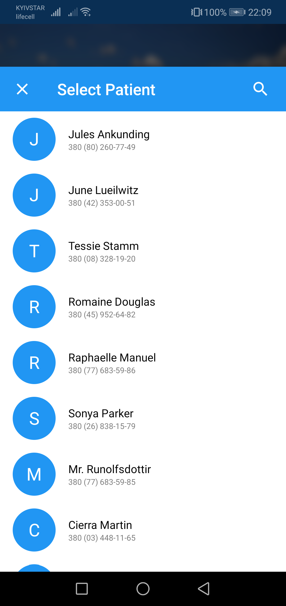

Next, what user will see, is calendar with preinstalled current day of month and time schedule for this day. It is possible to navigate to prev month by arrow left and next month by arrow right. Inside circle in center is current date and in tooltip on top-right is current day's patinets number. For selecting another date, just expand calendar by down arrow and select necessary date (like on image right). For adding new patient, just tap needed on "plus" in cell with necessary time and dialog with patients will appear This patients can be selected from contacts or can be added from web (also, in next tab of app there is feature for adding patient). If list of patients is to big, user can filter it, just tapping on search button on top right and start typing in appeared text field.

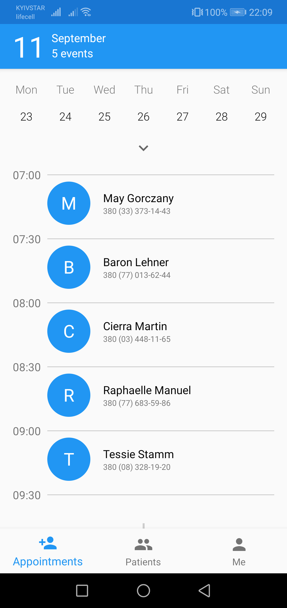 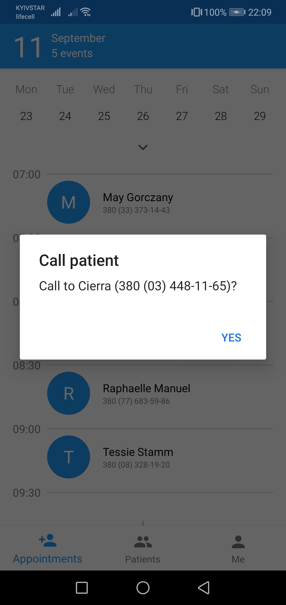 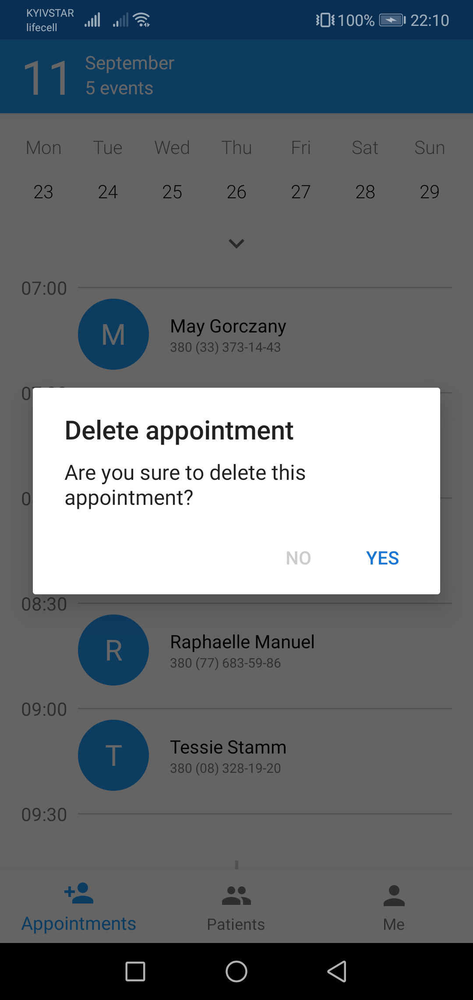

When user scrolled schedule, info about current day will be in toolbar in top left. Schedule stared from 7:00 AM and finished at 9:30 PM, splitted by 30 minutes. By short tap on patient in schedule, possible to call to selected patient and by long tap -- confirmation dialog before deleting will appear.

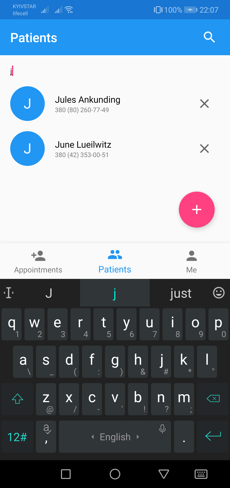 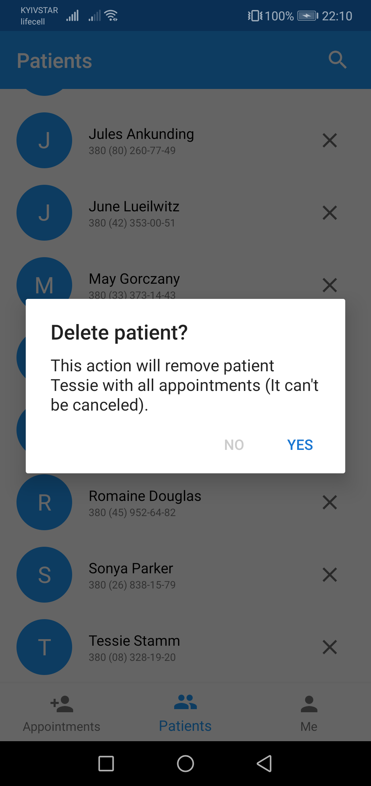 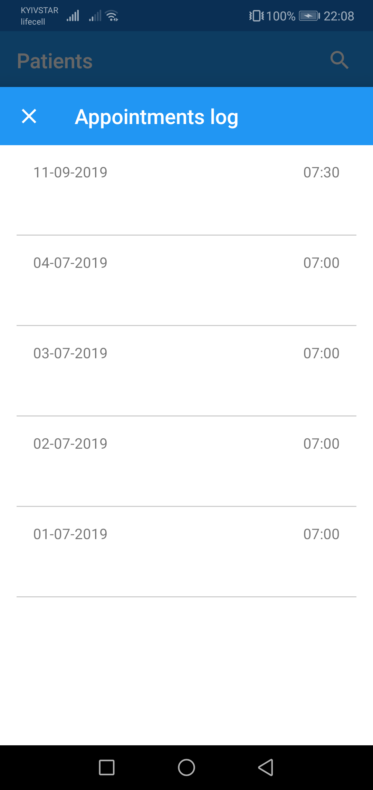

In second tab there're list of already exists patients and feature of adding new patient (fab). For now it's stubbed, so new patients can be added from contacts of user or from web ui. Also, here is search filter, via which user can filter patients, if list is big. Also, it is possible to delete data about patient, if it's necessary. Just tap on cross in row with necessary user and confirmation dialog will appear. The last feature here is patient history. For showing it, all is necessary, just tap on row with user, and appear dialog as on last image, where will be all visits of selected user.


From 29/09/2019 What features still not finished:
1) adding new patients from second tab in app by pressing fab. Need to make layout and full logic chat from ui to api layer.
2) maybe improve calendar: when user selected custom date (which is not on current week) and collapse the calendar, should be shown week with selected date.
3) speed improvements: whe user select prev or next month now it executes really slow, need to check, why it so slowly executes and fix this issue.
4) there is small bug, when user deleted patient from schedule and tap again on this cell, "call to this user" dialog will be shown.
5) Finish chain of registration. For now api call and ui are ready, need to tie them both, add viewmodel, usecase's logic and handle errors.
6) As small improvement: add feature "restore password", because for now it's impossible to restore password, only create new user or restore it in database in server manually
